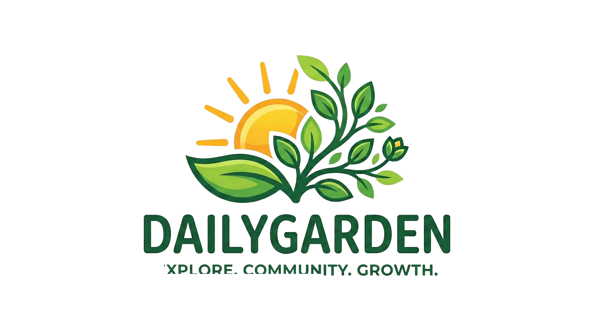

# 🌿 DailyGarden – Digital Gardening Journal

Welcome to **DailyGarden**, your ultimate companion for smart gardening! This is a complete, feature-rich digital journal and management tool for your plants, powered by AI to ensure your garden thrives.



## ✨ Key Features

-   **🤖 AI Disease Detection**: Upload photos of your plant's leaves to get instant, accurate diagnoses of 38 different plant diseases using HuggingFace ML models and Claude Vision.
-   **📅 Smart Reminders**: Never forget to water your plants! Set custom watering schedules and receive SMS reminders directly to your phone via Twilio.
-   **🔐 Google OAuth Integration**: Seamless and secure sign-in with your Google account.
-   **💳 Secure Payments**: Integrated Razorpay gateway for seamless transactions in our gardening marketplace.
-   **🌱 Garden Management**: Track all your plants across multiple gardens, monitor their growth stages, and keep detailed notes on each one.
-   **📈 Real-time Progress Tracking**: See your plants grow through different stages – from seed to harvest – with a visually appealing progress bar.

## 🚀 Technology Stack

-   **Frontend**: Vanilla HTML5, CSS3 (Modern, responsive design with glassmorphism and animations).
-   **Backend**: Node.js, Express.js.
-   **Database**: MongoDB (Mongoose ODM).
-   **AI Engines**: HuggingFace (MobileNetV2) & Claude-3.5-Sonnet Vision.
-   **APIs & Integrations**:
    -   **Passport.js**: Google OAuth 2.0.
    -   **Razorpay**: Payment Gateway.
    -   **Twilio**: SMS Reminder Service.
    -   **Node-Cron**: Background tasks for reminders.

## 🛠️ Getting Started

### 1. Prerequisites

-   Node.js (v16.x or higher)
-   MongoDB Atlas account or local MongoDB instance
-   API keys for Google OAuth, Razorpay, Twilio, and HuggingFace

### 2. Installation

1.  Clone the repository:
    ```bash
    git clone https://github.com/darshan-Code11/Digital-Garden.git
    cd Digital-Garden
    ```

2.  Install dependencies:
    ```bash
    npm install
    ```

### 3. Environment Variables

Create a `.env` file in the root directory and add the following:

```env
PORT=5000
MONGO_URI=your_mongodb_uri
SESSION_SECRET=your_session_secret

# Authentication
GOOGLE_CLIENT_ID=your_google_client_id
GOOGLE_CLIENT_SECRET=your_google_client_secret

# Payments
RAZORPAY_KEY_ID=your_razorpay_key_id
RAZORPAY_KEY_SECRET=your_razorpay_key_secret

# Reminders
TWILIO_ACCOUNT_SID=your_twilio_sid
TWILIO_AUTH_TOKEN=your_twilio_token
TWILIO_PHONE_NUMBER=your_twilio_phone

# AI Services
HF_API_KEY=your_huggingface_api_key
ANTHROPIC_API_KEY=your_anthropic_api_key
```

### 4. Running the Application

To start the server in production/normal mode:
```bash
npm start
```

The application will be available at `http://localhost:5000`.

## 🎯 Problem Statement

Urbanization and fast-paced lifestyles have disconnected many from nature, leading to neglected plants and failed indoor gardening attempts due to lack of knowledge and timely care. Plant diseases are often misdiagnosed or identified too late, leading to plant mortality.

## 💡 Objectives

- **Digital Companionship:** Provide a centralized platform to manage and track the lifecycle of various plants.
- **Intelligent Diagnostics:** Utilize machine learning to accurately identify plant diseases from images.
- **Proactive Care:** Implement an automated reminder system to ensure timely watering and maintenance.
- **E-commerce Ecosystem:** Create a marketplace for purchasing gardening supplies securely.

## 🏗️ System Architecture

The application follows a standard Client-Server architecture:
1. **Client-Side:** HTML5/CSS3/Vanilla JS interface handling user interactions and responsive design.
2. **Server-Side:** Node.js/Express.js backend providing RESTful APIs for authentication, plant management, disease diagnosis, and payments.
3. **Database:** MongoDB storing user profiles, garden details, tasks, and transaction history.
4. **External APIs:** Integration with Google (OAuth), Twilio (SMS), Razorpay (Payments), and HuggingFace/Claude (AI Vision).

## 🔮 Future Scope

- **IoT Integration:** Connecting with smart soil moisture sensors for automated watering and real-time alerts.
- **Community Forum:** A social space for gardeners to share tips, swap seeds, and ask questions.
- **Weather API Integration:** Adjusting watering schedules automatically based on local weather forecasts.
- **Advanced AR:** Augmented Reality features to visualize plant growth and placement in physical spaces.

## 👥 Contributors / Team

- **Darshan Gowda** - Developer & Project Lead

## 📂 Project Structure

-   `server.js`: The main Express server handling routing, database connections, and integrations.
-   `index.html`: The front-end entry point with all UI logic and styles.
-   `logo.png`, `logo_animation_mobile.mp4`: Branding and assets.
-   `fix.js`, `diagnose_advanced.js`: Utility scripts for system health and diagnostics.

---

Made with ❤️ for gardeners everywhere. Happy Gardening! 🌿🌻